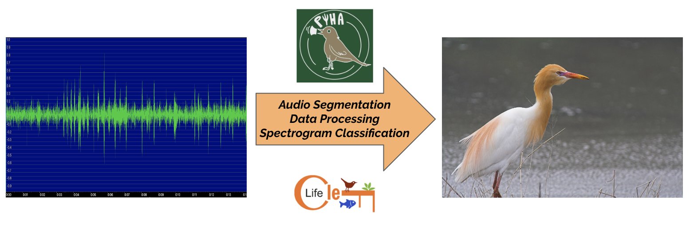
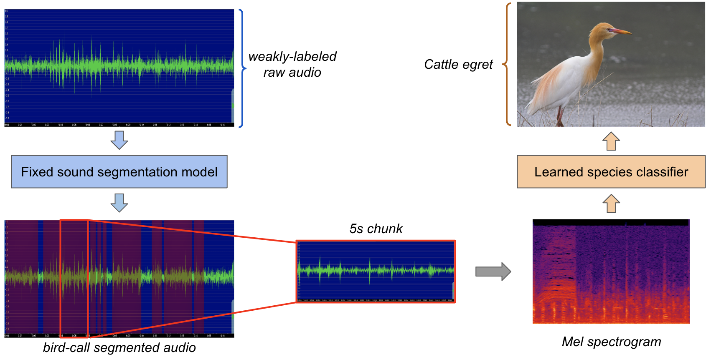
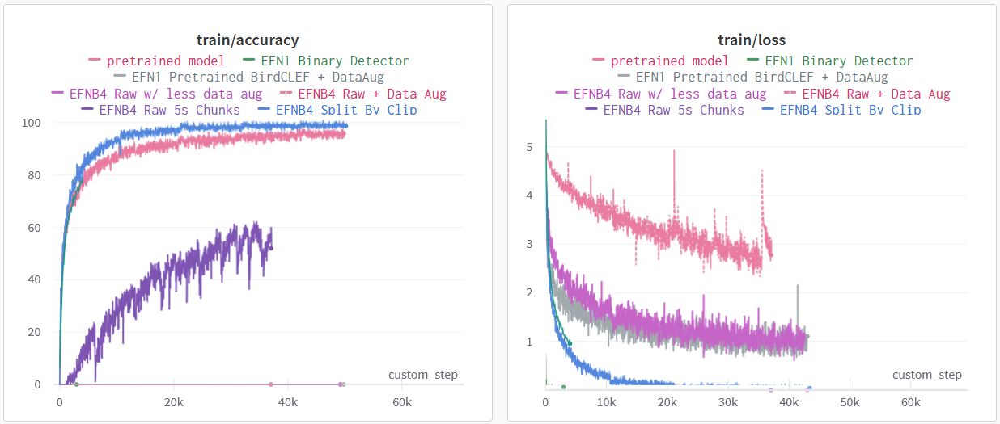

# Acoustic Multiclass Identification



## Contents
- [Project Overview](#project-overview)
- [Installation](#installation)
- [Data Setup](#data-setup)
- [Data Processing](#data-processing)
- [Classification](#classification)
    - [Logging](#logging)

## Project Overview

Passive acoustic monitoring (PAM) plays a crucial role in conservation efforts and the preservation of biodiversity. By capturing and analyzing the sounds produced by avian species in their natural habitats, this non-invasive method provides valuable insights into population dynamics, species richness, and habitat quality, as birds may act as key indicators of larger environmental effects. However, as PAM systems may collect terabytes of noisy audio data, with other species and human encroachment polluting the recordings, extracting useful information from such audio recordings (i.e. where are birds present in the recording, what species of birds are they, etc.) remains an open problem. 

Here, we present our first joint work with the UCSD [Engineers for Exploration](https://e4e.ucsd.edu/), [PyHa](https://github.com/UCSD-E4E/PyHa), and the [BirdCLEF2023 Kaggle Competition](https://www.kaggle.com/competitions/birdclef-2023), where we have designed a full pipeline for processing noisy audio recordings to train an acoustic bird species classifier.



Our main pipeline (shown above) can be described as follows:
1. For a given set of weakly-labeled noisy audio recordings (i.e. the entire recording may have a label for a bird species, but no information about where in the recording the call is), we use [PyHa](https://github.com/UCSD-E4E/PyHa) to extract 5s segment mel-spectrograms of the original audio, where each 5s segment is estimated to  include the bird call matching the given label.
2. We use this strongly labeled mel-spectra data to train a bird species classifier (as well as an optional bird detector), which at inference time is given an unlabeled 5s audio clip and predicts which species are present in the audio.

A detailed description of the project and producing it is shown below.

## Installation

We recommend that you use miniconda for all package management. Once miniconda is downloaded (see [here](https://conda.io/projects/conda/en/latest/user-guide/install/index.html) for information on miniconda installation), run the following command to setup the conda environment for the repo:

```bash
conda env create -f environment.yml
```

In order to recreate our results, [PyHa](https://github.com/UCSD-E4E/PyHa) needs to be installed and set up. Furthermore, our results are based off of the [BirdCLEF2023 dataset](https://www.kaggle.com/competitions/birdclef-2023). You may also find it useful to use a  [no-call dataset](https://www.kaggle.com/code/sprestrelski/birdclef23-uniform-no-call-sound-chunks) compiled from previous competitions.

## Data Setup
The data processing pipeline assume a folder directory structure as follows
```
data
├── XC113914.wav
├── XC208241.wav
└── XC324914.wav
├── XC126500.wav
└── XC294063.wav
└── ...
```

The data folder, cache folder (optional), and the CSV location must all be referenced in `config.py` before running `train.py`. In the CSV file the `"FILE NAME"` column must be the name of the file with no path preceding it. In this example, it would be `XC113914.wav`.

The CSV file referenced in `config.py` contains all metadata about clips in that dataset, which includes song file location, offset and duration of the clip, and species name. Using multiple different CSV files allows for different training scenarios such as using a small subset of clips to test a data augmentation technique.

We ran into issues running PyHa over `.ogg` files, so there is an included function in `gen_tweety_labels.py` to convert `.ogg` to `.wav` files and can be swapped out for your original filetype. This is an issue for the data processing pipeline. However, the training pipeline is able to predict on most filetypes.

## Data Processing

The first file in our data processing pipeline is `gen_tweety_labels.py`. After downloading and setting up PyHa, copy this script into the PyHa directory and cd into it. If PyHa was correctly set up, this script will run TweetyNet on the entire BirdCLEF2023 dataset in order to produce binary labels in a file called `BirdCLEF2023_TweetyNet_Labels.csv`. For example, if the BirdCLEF2023 directory called `train_audio` is located at `/share/acoustic_species_id`, the script can be run with the following command:

```bash
python gen_tweety_labels.py /share/acoustic_species_id
```

After generating the TweetyNet labels, we next run `attach_strong_labels.py`, we attach the strong labels as given from the `train_metadata.csv` included in the BirdCLEF2023 directory. This will produce a file called `BirdCLEF2023_Strong_Labels.csv`. Remember to include the path in the script as follows:

```bash
python attach_strong_labels.py /share/acoustic_species_id
```

Next, we need to chunk the data since some files are longer than the 5 second duration used at inference time. The script `gen_chunks_from_labels.py` chunks the clips in `BirdCLEF2023_Strong_Labels.csv` and outputs all of the chunks in a new directory called `BirdCLEF2023_train_audio_chunks`. To generate these chunks, we run the following command:

```bash
python gen_chunks_from_labels.py /share/acoustic_species_id
```

Next, we need to split the data into training and validation sets. These splits can either be done manually by putting clips in train/validation folders, or doing a random shuffle split. However, multiple audio chunks from a single file should be kept together in their respective folders to avoid data leakage. To do so automatically, we run the `distribute_chunks.py` script, which first distributes all of the audio files into 4:1 training/validation splits, and then distributes all of the chunks according to the file split. These chunks are stored in a new directory called `BirdCLEF2023_split_chunks`. We do so using the following command:

```bash
python distribute_chunks.py /share/acoustic_species_id
```


## Classification
The main file is `train.py`, which has the main training loop and uses functions from `dataset.py` and `model.py`. This has a number of hyperparameters related to training, logging, and data augmentation that can be passed in as arguments. For example, to run with a mixup probability of 0.6, with all other arguments kept to the defaults, you would run:

```py
python train.py –mix_p=0.6
```

These hyperparameters can also be changed in `config.py`.

To select a model, add a `model_name` parameter in `config.py` when instantiating `BirdCLEFModel`, or edit the `model.py` file directly. `model.py` loads in models using the [Pytorch Image Models library (timm)](https://timm.fast.ai/) and supports a variety of models including EfficientNets, ResNets, and DenseNets. To directly load local models, you would add another parameter for the checkpoint path:
```py
self.model = timm.create_model('tf_efficientnet_b1', checkpoint_path='./models/tf_efficientnet_b1_aa-ea7a6ee0.pth')
```

### Logging
This project is set up with [WandB](https://wandb.ai), a dashboard to keep track of hyperparameters and system metrics. You’ll need to make an account and login locally to use it. WandB is extremely helpful for comparing models live and visualizing the training process.



If you do not want to enable WandB logging, run with the argument `-l false`.